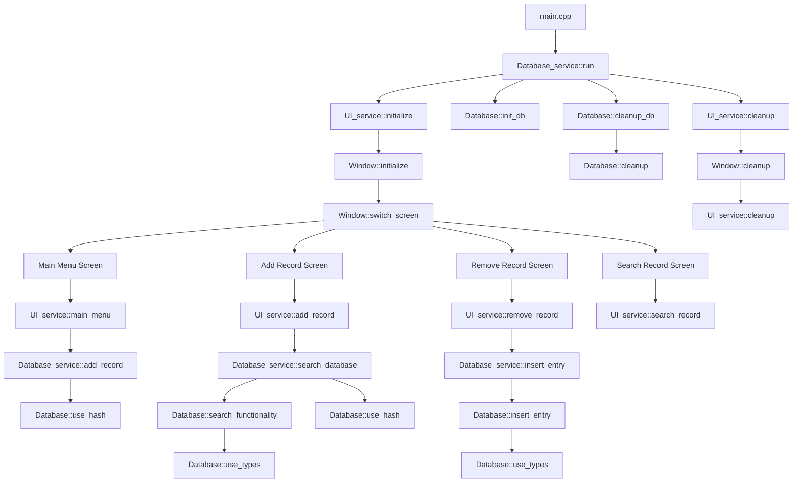

# HashbaseDB: Custom NoSQL Database Engine

A high-performance key-value store with an easy-to-use SDL interface, written for Linux systems.

## Features

- **O(1) lookups**: Fast search times for keys.
- **Multiple values per key**: Store multiple values for a single key using a vector-based structure.
- **Simple SDL interface**: A custom user interface built using SDL for easy interaction.
- **Efficient storage**: Binary storage format for fast data retrieval.

## Project Structure

HashbaseDB/
├── database/ # Database files
│ ├── index.idx # Index file for O(1) lookups
│ └── winkel.db # Main database storage
│
├── docs/ # Documentation
│ └── DESIGN.md # Design decisions
│
│
├── include/ # Header files
│ ├── core/ # Core database functionality
│ │ ├── database.hpp # Database operations
│ │ ├── hash.hpp # Hashing functions
│ │ └── trim.hpp # String utilities
│ │
│ ├── frontend/ # UI-related headers
│ │ ├── components/ # UI components
│ │ │ ├── add_record.hpp
│ │ │ ├── main_menu.hpp
│ │ │ ├── remove_record.hpp
│ │ │ └── search_record.hpp
│ │ ├── types.hpp # UI type definitions
│ │ └── window.hpp # Window management
│ │
│ ├── services/ # Service layer headers
│ │ ├── db_service.hpp # Database service
│ │ └── ui_service.hpp # UI service
│ │
│ └── test/ # Test headers
│ └── unit_tests.hpp # Unit test definitions
│
├── output/ # Build output
│ └── hashmap.h # Generated hash map header
│
└── src/ # Source files
├── core/ # Core implementations
│ ├── database.cpp # Database operations
│ └── hash.cpp # Hash functions
│
├── frontend/ # UI implementations
│ ├── components/ # UI component implementations
│ │ ├── add_record.cpp
│ │ ├── main_menu.cpp
│ │ ├── remove_record.cpp
│ │ └── search_record.cpp
│ └── window.cpp # Window management
│
├── services/ # Service implementations
│ ├── db_service.cpp # Database service
│ └── ui_service.cpp # UI service
│
├── test/ # Test implementations
│ └── unit_tests.cpp # Unit test suite
│
└── main.cpp # Application entry point

# Dependencies

    cmake, clang, SDL2

# How to run

    $cmake
    $cd build && make
    $./hashbase

## Program Flow Diagram

